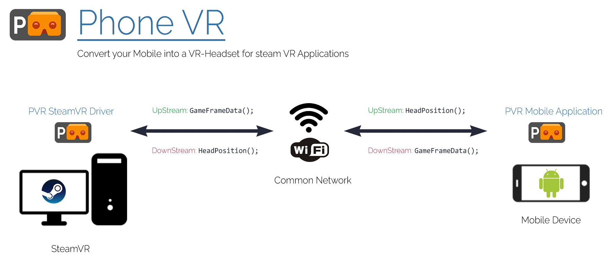
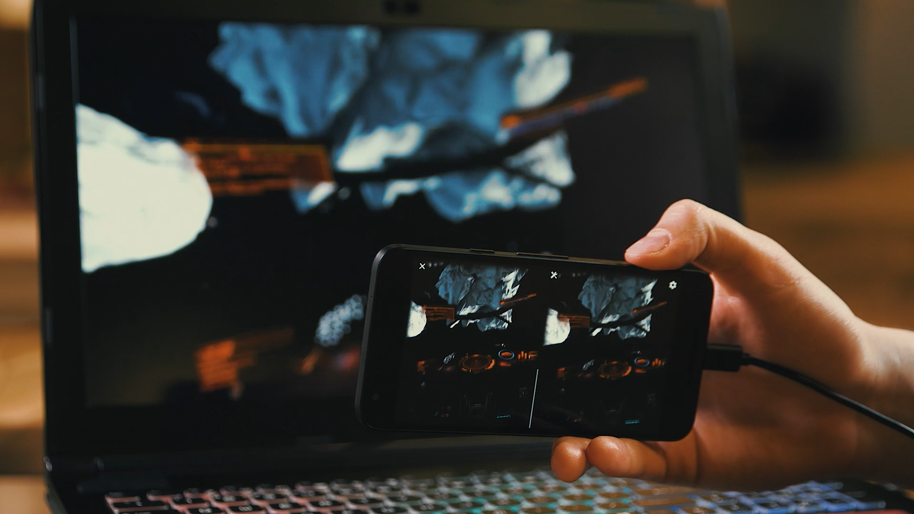
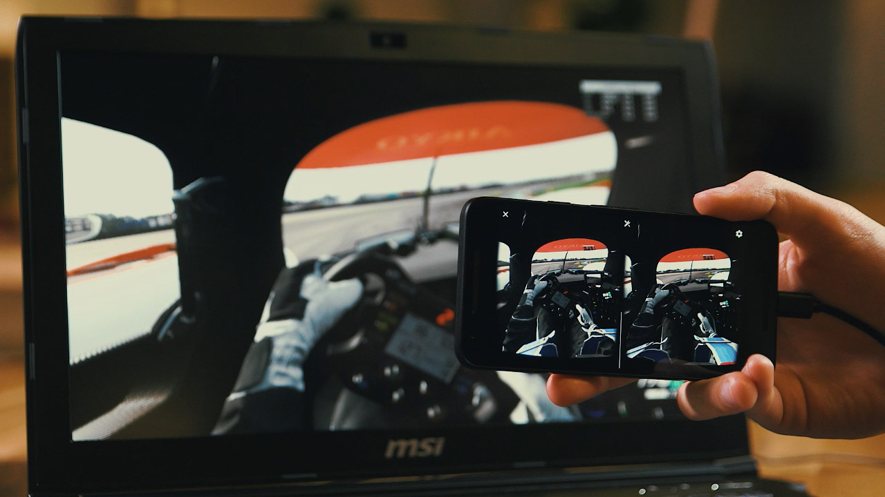
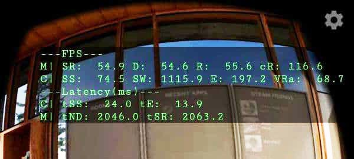

<br/><br/>
[](https://github.com/ShootingKing-AM/PhoneVR/releases)<br/><br/><br/>
[](https://github.com/ShootingKing-AM/PhoneVR/releases)<br/>
<br/><br/><br/>


<sup>Pictures used for representational purposes</sup>

[](https://ci.appveyor.com/project/ShootingKing-AM/phonevr)

[](https://discord.gg/pNYtBNk)

Use Steam VR-enabled applications with your phone as HMD (*Head-mounted display*). The only Open-Source solution to similar commercial packages like VRidge, Riftcat, Trinus etc etc.
<br/>

## Contents
* [Requirements](#requirements)
* [Installation](#installation)
* [Advanced Configuration](#advanced-configuration)
* [Development](#development)
* [Troubleshooting](#troubleshooting)
* [Issues](#issues)

## Requirements

A PC with *Windows 7 or above*, A smartphone with *Android 5.0(Lollipop) or above* with *OpenGL-ES 3.0 or above*, Steam and some SteamVR applications installed.

## Installation

* Make sure you have Steam and SteamVR installed (To find SteamVR on steam, `Library -> Tools -> SteamVR`).
* Download latest [`PhoneVR.zip`](https://github.com/ShootingKing-AM/PhoneVR/releases) release of this repository.
* Download the repository files. Run the script `install-PhoneVR.bat`, located in the `driver` folder.
  - **Note**: The batch file assumes that "Steam" is installed in Default path, if have installed Steam in a different path you might have to have edit the batch file `Ln39 (Win32)` or `Ln41 (Win64)` respecitively. <br/>
    *Eg*. If you have installed Steam in different driver altogether, now, If your Steam Location is `I:\Program Files\Steam` and you are on `Win64`,
        you would change the `Ln41` from <br/>
        `  "C:\Program Files (x86)\Steam\steamapps\common\SteamVR\bin\win64\vrpathreg" adddriver %instpath%\PVRServer` to <br/>
        `  "I:\Program Files\Steam\steamapps\common\SteamVR\bin\win32\vrpathreg" adddriver %instpath%\PVRServer`
* Copy `driver_PVRServer.dll` (from `[PhoneVR.zip]/windriver/[win64 or win32]`) to you local-driver-folder)
  `local-driver-folder` by default is: `C:\Program Files\PhoneVR\PVRServer\bin\[win32 or win64]\`
* Install the Apk on your mobile from `[PhoneVR.zip]/android/arm64`.

To **play**, **first open the Phone App**(SteamVR should also be closed), then run the game of your choice on PC. (Obviously, both PC and Mobile should be on same Network, preferably Wifi 5.0)

## Advanced Configuration

* **Windows Driver Settings**

  Windows SteamVR Driver, auto loads with SteamVR, and gets `FrameTextures` from VRApplication(like SteamVR Home, VRChat, etc.) via SteamVR. These Textures are then Encoded and Streamed, at specified `game_fps`, to Mobile device using x264 Encoder. Some configurations of this encoder can be adjusted via, `pvrsettings.json` in default installation location `C:\Program Files\PhoneVR`.<br/>
  **Default Settings :**
    ```json
    {
        "enable" : true,
        "game_fps" : 65,
        "video_stream_port" : 15243,
        "pose_stream_port" : 51423,
        "pairing_port" : 33333,
        "encoder" : {
            "preset" : "ultrafast",
            "tune" : "zerolatency",
            "qp" : 20,
            "profile" : "baseline"
        }
    }
    ```
    Most settings are self-explanatory. Any change in settings will require SteamVR to be restarted for application.
    * *"encoder"* : Encoder x264 Settings
      - *"preset"* : Can be set to "ultrafast", "superfast", "veryfast", "faster", "fast", "medium", "slow", "slower", "veryslow" or "placebo"
        Warning: the speed of these presets scales dramatically.  Ultrafast is a full 100 times faster than placebo!
        These presets affect the encoding speed. Using a slower preset gives you better compression, or quality per filesize, whereas faster presets give you worse compression. In general, you should just use the preset you can afford to wait for. 
        
      - *"tune"* : Can be set to "film", "animation", "grain", "stillimage", "psnr", "ssim", "fastdecode", "zerolatency"
      Tune affects the video quality(and size), film being the best quality and gradually decreasing to the right
      
      - *"profile"* :  Can be set to  "baseline", "main", "high", "high10", "high422", "high444"
      Applies the restrictions of the given profile. Currently available profiles are specified above, from most to least restrictive. Does NOT guarantee that the given profile will be used: if the restrictions of "High" are applied to settings that are already Baseline-compatible, the stream will remain baseline.  In short, it does not increase settings, only decrease them.
      
      - *"qp"* : Quantization packet constant, Range 0-51, 0-Lossless 
      
      - *"rc_method"* : Rate Control Method, 1/2/3
      Constant QP (CQP) - 0; 
      Constant Rate factor (CRF) - 1; 
      Average Bitrate (ABR) - 2;
      Default is 1 i.e., CRF with rf 24 (and rf_max 26)
      
      Other standard x264 settings,
      - *"qcomp"* : Default : 0
      - *"keyint_max"* : Default : -1
      - *"intra_refresh"* : Default : False
      - *"bitrate"* : Default : -1 (min 1000)
      
  Do only adjust when required, and keep a eye on `pvrlog.txt` file in default installation location `C:\Program Files\PhoneVR` for "*Skipped frame! Please re-tune the encoder parameters*" messages. If you are getting these messages in excess, you may wish to downgrade settings since windows does not seems to have enough processing power and resources to render with existing settings.

## Development
This Project is presently under testing. But, pull requests are welcome. 

* Windows Driver: `<root>/code/windows/PhoneVR.sln`
  * Compiled/Tested on `Microsoft Visual Studio 2017`
  * After building copy the `driver_PhoveVR.dll` and other files from `<solution root>/build/[win32 or x64]/` to local driver folder.
  * For Runtime debugging, You need to Attach `MSVS JIT debugger` to `vrserver.exe` (which actually loads the driver_PhonveVR.dll)
  * For testing, this project has 2 Build Configs, Debug and Release. Debug has lots of debugging callouts to both local-driver-folder/pvrlog.txt and MSVS Debugger Output.

* Android App: App folder: `<root>/code/mobile/android/PhoneVR`
  * Compiled/Tested on `Android Studio 4.0.1`
  * For testing, this project has 2 Build Configs, Debug and Release. Debug has lots of debugging callouts to logcat from both JAVA and JNI.
  
* External Vendor Libraries used (all Headers included in respective Projects):
  * Json v3.8.0 (https://github.com/nlohmann/json) (code\windows\libs\json)
  * Eigen v3.3.7 (https://gitlab.com/libeigen/eigen) (code\common\libs\eigen)
  * Asio v1.12.2 (https://sourceforge.net/projects/asio/files/asio/1.12.2%20%28Stable%29/) (code\common\libs\asio)
  * x264 0.161.r3015 MSVS15(2017) (https://github.com/ShiftMediaProject/x264)
  * GoogleVR 1.200 (https://github.com/googlevr/gvr-android-sdk) (code\mobile\android\libraries\jni)

## Troubleshooting  
* Android App doesn’t connect to Windows Steam VR even after opening Phone App first and then SteamVR on windows
  1. Make sure that both the Windows and Android devices are in the same Local Network. (connected to the same router/wifi device)
  2. Sometimes, the port which PhoneVR use to connect win/mobile devices, also known as `Pairing Port (default :33333)`, might be used by other services on your devices(Windows/Android). Try changing the "Pairing Port" on `Android PhoneVR App` settings and `pairing_port` in `C:\Program Files\PhoneVR\pvrsettings.json` for `Windows PVR driver` and restart SteamVR. **Both Windows Pairing port and Android Pairing port should be the same**. Safe recommended port range : `30000 - 65535`
  
* Android App automatically comes back to "Discovery"(Home/AppStart) page after some VR Application usage
  - Check if `Android System Battery saver` or similar applications are killing the app when in background. Usually can be found is `Android Setting` -> `Application Manager` or `Application Settings` according to your Android device flavour/OEM.

* Lag while using VR App on mobile
  - All relevant component's FPS are displayed on Mobile device when `Settings -> Debug` is checked. You can find out what the bottleneck component in the whole chain from VRApplication on windows to GoogleVR SDK renderer on Android is and resolve it.
  
  FPS Nomenclature (in order from VRAppFrameCreation to MobileFrameDisplay:
  * `C |` - CPU (Windows) Components
    * `VRa` - Actual VRApplication Rendering FPS (SteamVR Home, VRChat, . etc etc)
    * `E` - Media Encoder (x264) FPS
    * `SS` - Network Stream Sender FPS
  * `M |` - Mobile Components
    * `SR` - Network Stream Receiver FPS
    * `D` - Media Decoder FPS
    * `R` - OpenGL Renderer FPS - Final on mobile screen FPS<br/><br/>
  

## Issues
You can use the `Github Issues` to submit any issues related to working of this Solution.
For quick resolution you may want to add the following data along with your issue,
* `steamvr.vrsettings` file in default location `C:\Program Files (x86)\Steam\config\steamvr.vrsettings`
* `vrserver.txt` file in default location `C:\Program Files (x86)\Steam\logs\vrserver.txt`
* `pvrLog.txt` and/or `pvrDebugLog.txt` file(s) in default windows location `C:\Program Files\PhoneVR`
* `pvrLog.txt` and/or `pvrDebugLog.txt` file(s) in default android location `.../Android/data/virtualis.phonevr/files/PVR/` and/or `Log` from your `Settings page` on the app.
* Open a `cmd` in the follow default directory and copy paste output of the `vrcmd` command. `C:\Program Files (x86)\Steam\steamapps\common\SteamVR\bin\win64\vrccmd.exe`
* And ofcourse, how to reproduce the issue :)

